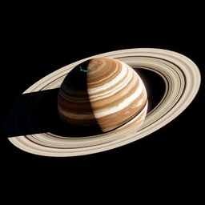
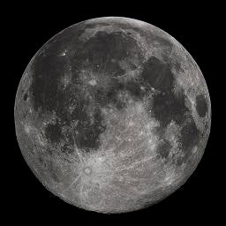

# Postgres-Universe

 

This is the Celestial Bodies assignment in PostGres from Free Code Camp. The project required the development of a database with 5 tables by using Linux/ Unix command line. The four main tables are defined as:
<ol>
<li>Galaxy

</li>
<li>Star

</li>
<li>Planet

</li>
<li>Moon

</li>
</ol>

A fifth table of my choosing is required by the user story, and I included an "asteriod" table. Primarily, this project required that I relate tables by using foreign_keys that referenced subcategories. For example, the moon table referenced a planet_id column from the planet table to describe the planet for which the moon orbits.

Celestial Bodies Database

Below are the project requirements as define by Free Code Camp:

Instructions:

Complete the tasks below

1. You should create a database named universe

1. Be sure to connect to your database with \c universe. Then, you should add tables named galaxy, star, planet, and moon

1. Each table should have a primary key

1. Each primary key should automatically increment

1. Each table should have a name column

1. You should use the INT data type for at least two columns that are not a primary or foreign key

1. You should use the NUMERIC data type at least once

1. You should use the TEXT data type at least once

1. You should use the BOOLEAN data type on at least two columns

1. Each "star" should have a foreign key that references one of the rows in galaxy

1. Each "planet" should have a foreign key that references one of the rows in star

1. Each "moon" should have a foreign key that references one of the rows in planet

1. Your database should have at least five tables

1. Each table should have at least three rows

1. The galaxy and star tables should each have at least six rows

1. The planet table should have at least 12 rows

1. The moon table should have at least 20 rows

1. Each table should have at least three columns

1. The galaxy, star, planet, and moon tables should each have at least five columns

1. At least two columns per table should not accept NULL values

1. At least one column from each table should be required to be UNIQUE

1. All columns named name should be of type VARCHAR

1. Each primary key column should follow the naming convention table_name_id. For example, the moon table should have a primary key column named moon_id

1. Each foreign key column should have the same name as the column it is referencing

